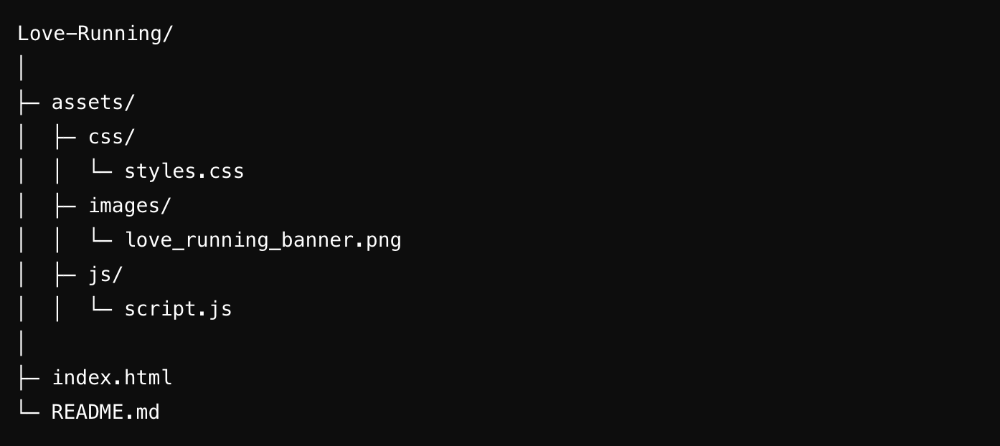

# Love Running


A web application designed for running enthusiasts to track their progress, set goals, and stay motivated on their fitness journey. This project was created as part of **Code Institute's Full-Stack Developer Program** and is the first code-along project I've ever completed.

**Repository:** [https://github.com/wgwhitecoding/Love-Running](https://github.com/wgwhitecoding/Love-Running)


**Live Link** [Play Scubisteve Diving Game Live](https://wgwhitecoding.github.io/Love-Running/)

---

## Table of Contents
- [Overview](#overview)
- [Features](#features)
- [How to Use](#how-to-use)
- [Installation & Setup](#installation--setup)
- [Folder Structure](#folder-structure)
- [Technology Used](#technology-used)
- [Future Enhancements](#future-enhancements)
- [Contributing](#contributing)
- [Author](#author)
- [🤝 Connect with Me](#connect-with-me)

---

## Overview

**Love Running** is a web application tailored for runners to help them monitor their progress, set fitness goals, and stay connected with the running community. Whether you're training for a marathon or just enjoy casual runs, this app is designed to keep you on track and motivated.

This project was created as part of **Code Institute's Full-Stack Developer Program** and holds special significance as it is the first code-along I have completed during the course.

---

## Features


- **Gallery:** Gallery.
- **Community Connection:** Engage with other runners and share your achievements.
- **Responsive Design:** Fully functional across desktop, tablet, and mobile devices.

---

## How to Use

1. Open the application and sign up for a free account.
2. Log your runs with details like distance, time, and date.
3. Set goals for weekly or monthly mileage and monitor your progress.
4. Join the running community to share your achievements and find inspiration.

---

## Installation & Setup

1. **Clone the Repository:**
   ```bash
   git clone https://github.com/wgwhitecoding/Love-Running.git

2. **Navigate to the Project Directory:**

    ```bash
    cd Love-Running
3. **Open the Application:**

- Open the index.html file in your favorite web browser. No additional setup or dependencies required.

## Folder Structure



## Technology Used

### Frontend Technologies

- [](https://developer.mozilla.org/en-US/docs/Web/HTML)  
  **HTML5:** Used to structure the application layout and elements.

- [](https://developer.mozilla.org/en-US/docs/Web/CSS)  
  **CSS3:** Provides styling and ensures a responsive and visually appealing design.

- [](https://developer.mozilla.org/en-US/docs/Web/JavaScript)  
  **JavaScript:** Implements user interactions and progress tracking features.

---

## Future Enhancements

- **Enhanced Analytics:** Introduce detailed analytics like pace, calories burned, and heart rate monitoring.
- **Social Sharing:** Add options to share progress directly to social media platforms.
- **Mobile App:** Develop a mobile version of the application for iOS and Android.
- **Integration with Wearables:** Allow integration with devices like Fitbit and Garmin for automatic run tracking.

---

## Contributing

Contributions are welcome! To get involved:

1. **Fork** the repository.
2. **Create a new branch** for your feature or bugfix.
3. **Make your changes** and test thoroughly.
4. **Submit a pull request** describing your modifications.

We encourage contributions that enhance functionality, improve user experience, or fix bugs.

---

## Author

Created and maintained by **[Walid Will White](https://github.com/wgwhitecoding)**. Dedicated to making fitness more accessible and enjoyable through technology. This project was my **first code-along project** during the **Code Institute Full-Stack Developer Program**, marking a significant milestone in my learning journey.

---

## 🤝 Connect with Me <a id="connect-with-me"></a>

[](https://github.com/wgwhitecoding)  
[](https://www.linkedin.com/in/walidwillwhite/)  
[](mailto:walidwillwhite@gmail.com)

---

⭐️ Thanks for visiting! Feel free to explore my repositories and star any that interest you. 😊
